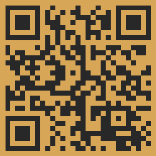

<div align="center">
  <h1 align="center">qr-rs</h1>

  
  
  
  
  
  
  
  

  
</div>

Command Line Interface utility to encode URLs or more generally text into QR
codes in various file formats and colors.

## Index

- [Install](#install)
  * [Cargo](cargo)
    - [Master branch](#master-branch)
    - [Latest release](#latest-release)
  * [AUR](aur)
- [Uninstall](#uninstall)
- [Usage](#usage)
- [Changelog](#changelog)
- [License](#license)

## Install

The following installation instructions assume a **Rust toolchain** (`rustc >=1.62.0`) installed
on the system. In order to install such toolchain you can use `rusutp`: see
https://www.rust-lang.org/tools/install for further installation
instructions and notes.

### Cargo

In order to install using Rusts' package manager `cargo` follow instructions
below.

#### Master branch

To build and install from master branch run:
```sh
cargo install --git https://github.com/marcoradocchia/qr-rs --branch master
```

#### Latest release

To build and install the latest release from
[crates.io](https://crates.io/crates/qr-rs) run:
```
cargo install qr-rs
```

### AUR

For **Arch Linux** (and other Arch based distros) a binary package[^1] is
available in the **AUR** (**A**rch **U**ser **R**epository):

- [qr-rs-bin](https://aur.archlinux.org/packages/qr-rs-bin)

You can install it using an _AUR helper_ such as `yay`:
```sh
yay -S qr-rs-bin
```
or `paru`:
```
paru -S qr-rs-bin
```

[^1]: Currently only `x86_64`

## Uninstall

To uninstall run:
```
cargo uninstall qr-rs
```

## Usage
```
qr-rs 0.1.0
Marco Radocchia <marco.radocchia@outlook.com>
Encode URLs or text into QR codes.

USAGE:
    qr [OPTIONS] <STRING>

ARGS:
    <STRING>    String to encode

OPTIONS:
    -b, --bg <BG>            Foreground color (hex code) [default: #FFF]
    -f, --fg <FG>            Background color (hex code) [default: #000]
    -h, --help               Print help information
    -o, --output <OUTPUT>    Output file (supported file extensions: jpeg, jpg, png, svg); omit to
                             print QR code to console
    -s, --scale <SCALE>      Scale factor (raster image output only) [default: 25]
    -V, --version            Print version information
```

## Changelog

Complete [CHANGELOG](CHANGELOG.md).

## License

[GPLv3](LICENSE)
